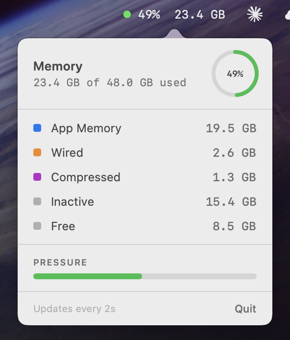

# RAMMonitor

RAMMonitor is a lightweight macOS menu bar app that shows current memory usage at a glance and opens a detailed popover with a RAM breakdown.

## Running

When the app is running, it lives in the macOS menu bar and updates the label every 2 seconds.



## Features

- Menu bar memory usage indicator with a color status dot
- Popover with used, wired, compressed, inactive, and free memory
- Circular usage gauge and pressure bar
- Fast refresh cadence for near real-time monitoring

## Build And Launch

Requirements:

- macOS
- Xcode command line tools or Xcode installed

Debug build and launch:

```bash
bash build.sh
```

Release build:

```bash
bash build.sh release
```

The app bundle is written under `build/`.
